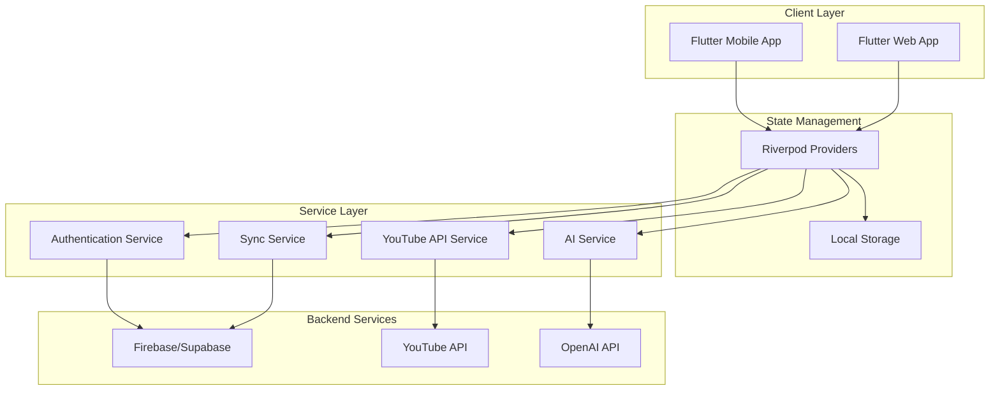
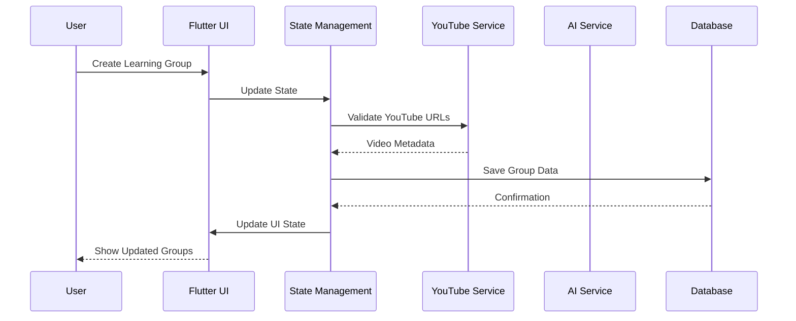
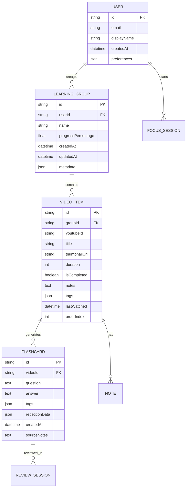

# Design Document

## Overview

DeepWatch is a cross-platform learning application built with Flutter that transforms YouTube videos into structured learning experiences. The application uses a single codebase to target mobile (iOS/Android) and web platforms, integrating YouTube API, AI services, and real-time synchronization to provide a comprehensive learning environment with focus modes, note-taking, and spaced repetition flashcards.

## Architecture

### High-Level Architecture



### Data Flow Architecture



## Components and Interfaces

### Core Components

#### 1. Learning Group Management
- **LearningGroupRepository**: Handles CRUD operations for learning groups
- **YouTubeService**: Validates URLs, fetches metadata, handles video embedding
- **GroupProgressTracker**: Calculates and maintains progress statistics

#### 2. Video Player Integration
- **VideoPlayerWidget**: Custom Flutter widget wrapping YouTube player
- **NotesEditor**: Markdown editor with auto-save functionality
- **FocusModeController**: Manages device locking and timer functionality

#### 3. AI Integration
- **FlashcardGenerator**: Interfaces with AI API for content generation
- **TranscriptProcessor**: Extracts and processes video transcripts
- **TaggingService**: Auto-generates tags for content organization

#### 4. Flashcard System
- **SpacedRepetitionEngine**: Implements SM2 algorithm for review scheduling
- **FlashcardRepository**: Manages flashcard CRUD operations
- **ReviewSessionManager**: Handles different review modes and progress tracking

### Key Interfaces

```dart
// Core domain interfaces
abstract class LearningGroupRepository {
  Future<List<LearningGroup>> getAllGroups();
  Future<LearningGroup> createGroup(String name, List<String> youtubeUrls);
  Future<void> updateGroup(LearningGroup group);
  Future<void> deleteGroup(String groupId);
}

abstract class FlashcardService {
  Future<List<Flashcard>> generateFromContent(String notes, String transcript);
  Future<List<Flashcard>> getFlashcardsForVideo(String videoId);
  Future<void> updateReviewSchedule(String flashcardId, int difficulty);
}

abstract class SyncService {
  Future<void> syncUserData();
  Stream<SyncStatus> get syncStatus;
  Future<void> enableOfflineMode();
}
```

## Data Models

### Core Data Models

```dart
class LearningGroup {
  final String id;
  final String name;
  final List<VideoItem> videos;
  final DateTime createdAt;
  final DateTime updatedAt;
  final double progressPercentage;
  final Map<String, String> metadata;
}

class VideoItem {
  final String id;
  final String youtubeId;
  final String title;
  final String thumbnailUrl;
  final Duration duration;
  final bool isCompleted;
  final String notes;
  final List<String> tags;
  final DateTime lastWatched;
}

class Flashcard {
  final String id;
  final String question;
  final String answer;
  final String sourceVideoId;
  final List<String> tags;
  final SpacedRepetitionData repetitionData;
  final DateTime createdAt;
  final String sourceNotes;
}

class FocusSession {
  final String id;
  final Duration duration;
  final DateTime startTime;
  final String videoId;
  final bool isActive;
  final FocusMode mode;
}
```

### Database Schema Design



## Error Handling

### Error Categories and Strategies

#### 1. Network Errors
- **YouTube API failures**: Graceful degradation with cached metadata
- **AI service timeouts**: Fallback to manual flashcard creation
- **Sync failures**: Queue operations for retry with exponential backoff

#### 2. Platform-Specific Errors
- **Focus mode restrictions**: Handle platform permissions gracefully
- **Video playback issues**: Provide alternative viewing options
- **Storage limitations**: Implement data cleanup strategies

#### 3. User Input Validation
- **Invalid YouTube URLs**: Real-time validation with helpful error messages
- **Empty content**: Prevent creation of empty groups/flashcards
- **Sync conflicts**: Implement conflict resolution with user choice

### Error Handling Implementation

```dart
class ErrorHandler {
  static void handleError(AppError error) {
    switch (error.type) {
      case ErrorType.network:
        _handleNetworkError(error);
        break;
      case ErrorType.validation:
        _showValidationError(error);
        break;
      case ErrorType.platform:
        _handlePlatformError(error);
        break;
    }
  }
  
  static void _handleNetworkError(AppError error) {
    // Implement retry logic and offline fallbacks
    if (error.isRetryable) {
      RetryService.scheduleRetry(error.operation);
    }
    NotificationService.showError("Connection issue. Retrying...");
  }
}
```

## Testing Strategy

### Testing Pyramid

#### 1. Unit Tests (70%)
- **Repository layer**: Mock external dependencies
- **Business logic**: Test spaced repetition algorithms
- **Data models**: Validate serialization/deserialization
- **Utility functions**: Test YouTube URL validation, markdown processing

#### 2. Integration Tests (20%)
- **API integration**: Test YouTube API and AI service integration
- **Database operations**: Test CRUD operations with real database
- **Cross-platform sync**: Validate data synchronization across devices

#### 3. Widget Tests (10%)
- **UI components**: Test video player, notes editor, flashcard widgets
- **Navigation flows**: Test user journeys through the app
- **Focus mode**: Test device locking and timer functionality

### Test Implementation Strategy

```dart
// Example test structure
group('FlashcardGenerator Tests', () {
  late FlashcardGenerator generator;
  late MockAIService mockAIService;
  
  setUp(() {
    mockAIService = MockAIService();
    generator = FlashcardGenerator(mockAIService);
  });
  
  testWidgets('generates flashcards from notes and transcript', (tester) async {
    // Test implementation
  });
  
  test('handles AI service failures gracefully', () async {
    // Test error handling
  });
});
```

### Platform-Specific Testing

#### Mobile Testing
- **Focus mode device locking**: Test on actual devices
- **Background sync**: Verify data sync when app is backgrounded
- **Touch interactions**: Test swipe gestures for flashcard review

#### Web Testing
- **YouTube embedding**: Test iframe integration and security
- **Keyboard shortcuts**: Validate desktop-specific interactions
- **Responsive design**: Test across different screen sizes

### Performance Testing
- **Large learning groups**: Test with 100+ videos per group
- **Flashcard review sessions**: Test with 1000+ flashcards
- **Offline sync**: Test sync performance with large datasets
- **Memory usage**: Monitor memory consumption during video playback

### Accessibility Testing
- **Screen reader compatibility**: Test with TalkBack/VoiceOver
- **Keyboard navigation**: Ensure full keyboard accessibility
- **Color contrast**: Validate against WCAG guidelines
- **Focus indicators**: Test focus management in focus mode